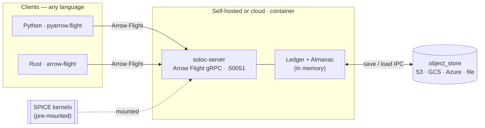

# soloc-server

**The network face of [soloc](../../).** An [Arrow Flight](https://arrow.apache.org/docs/format/Flight.html)
gRPC server (tonic + arrow-flight) that hosts a single [`soloc-ledger`](../soloc-ledger/) `Ledger`
and an anise `Almanac`, and speaks Arrow to any client in any language. Push observations, query
them back, and reproject to any frame, all over the wire, zero-copy.

## System

The server is a single binary. Point it at a config, mount your SPICE kernels, and it holds a
ledger in memory while persisting to local disk or an object store. It is built to be run in a
container, self-hosted or on a cloud, though **no Dockerfile ships yet** (see roadmap); the shape
below is the intended deployment.



On startup the server loads its ledger from a local path or object-store URL (falling back to an
empty ledger); on `SIGTERM` it drains in-flight work and persists. Configuration is read from
`$SOLOC_CONFIG`, then `./config.toml`, then sensible in-memory defaults:

```toml
# config.toml
[server]
bind = "0.0.0.0:50051"

[storage]
# ledger_url (s3:// gs:// az:// file://) takes priority over ledger_path.
ledger_path = "/var/data/ledger.arrows"
# schema_path = "/var/data/schema.arrow"   # optional zero-row IPC schema for a fresh ledger
id_column = "entity_id"

[ephemeris]
kernels = ["/path/to/de440s.bsp", "/path/to/pck11.pca"]
```

Kernels resolve in order: the `kernels` list, then `SOLOC_KERNEL_PATHS` (colon-separated), then
`MetaAlmanac::latest()` (downloads DE440s + PCK, ~150 MB, cached locally). With no kernels the
server still starts, but astronomical transforms will fail.

```bash
# Zero-config: in-memory ledger, entity schema, bound to 0.0.0.0:50051
cargo run --release -p soloc-server

# With kernels mounted (no network at runtime)
SOLOC_KERNEL_PATHS=/path/to/de440s.bsp:/path/to/pck11.pca \
  cargo run --release -p soloc-server
```

## A simple use case

Any Arrow Flight client works. Here is `pyarrow.flight`:

```python
import pyarrow.flight as fl
import json

client = fl.FlightClient("grpc://localhost:50051")

# Push observations. There is no frame-registration step: a frame exists the moment a row
# declares it, and the server derives the parent edge from the data. Cycles and unreachable
# parent frames are rejected at append time.
writer, _ = client.do_put(fl.FlightDescriptor.for_path(["obs"]), batch.schema)
writer.write_batch(batch)
writer.close()

# "Where is everything now?", restricted to specific entities. Ids may be given as the
# (authority, name) they mint from, an astronomical (ephemeris_id, orientation_id) pair, or raw hex.
ticket = fl.Ticket(json.dumps({
    "query_type": "current_state",
    "entity_ids": [
        {"authority": "acme.com", "name": "radar_boresight"},
        {"ephemeris_id": 399, "orientation_id": 399},
    ],
}).encode())
table = client.do_get(ticket).read_all()

# Reproject to another frame for visualization (target_units is a soloc.length_unit code; 1 = km).
writer, reader = client.do_exchange(
    fl.FlightDescriptor.for_command(json.dumps({"target_frame": "GCRF", "target_units": 1}).encode())
)
writer.write_batch(batch)
writer.done_writing()
transformed = next(reader).data
```

## Roadmap

- [x] **Proof-of-concept demo complete** — Flight `do_get` / `do_put` / `do_exchange` plus the
  federation and lifecycle actions, over object-store-backed persistence
- [ ] **Work with end users to implement desired features** — driven by real deployments
- [ ] **Dockerfile & deployment manifests** — ship the containerized shape the diagram implies

## License

Apache-2.0. See the [workspace README](../../) for the ecosystem overview.
