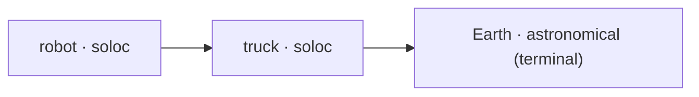

# spacetimestamp

**The core of the [soloc](../../) ecosystem.** This crate defines the Arrow
`spacetimestamp` schema. One row = one measurement of *where something is, in what frame, at what
instant*. The core includes the pipeline that validates, relates, reprojects, and filters those rows 
as follows:

```text
builder → validate → topology → transform → filter
```

## The schema

`sts_schema()` returns the fixed 11-field `spacetimestamp` struct. Every field is required except
the two covariance columns.

| Field | Arrow type | Purpose |
|---|---|---|
| `frame_id` | `FixedSizeBinary(16)` · `arrow.uuid` | id of the reference frame the pose is expressed in |
| `units_pos` | `UInt8` · `soloc.length_unit` | length-unit code for `position` |
| `timescale_id` | `UInt8` · `soloc.timescale` | time scale the epoch is measured on |
| `source_id` | `FixedSizeBinary(16)` · `arrow.uuid` | id of the observer/process that produced the row |
| `estimate_type` | `UInt8` · `soloc.estimate_type` | how the row was arrived at |
| `position` | `FixedSizeList(3, f64)` | `[x, y, z]` translation |
| `quaternion` | `FixedSizeList(4, f64)` | `[w, x, y, z]` orientation |
| `duration_centuries` | `Int16` | whole-centuries half of the epoch offset from J2000 TAI |
| `duration_ns` | `UInt64` | sub-century nanosecond remainder of the offset |
| `position_covariance` | `FixedSizeList(6, f64)` *(nullable)* | upper triangle of the 3×3 position covariance |
| `orientation_covariance` | `FixedSizeList(6, f64)` *(nullable)* | upper triangle of the 3×3 orientation covariance (axis-angle) |

Epochs are a two-part offset from the **J2000 TAI** reference (`2000-01-01T12:00:00 TAI`): whole
centuries in `duration_centuries`, the remainder in `duration_ns`, reconstructed with the row's own
`timescale_id`. Rows are built with `SpaceTimestampBuilder` and read back with `StsColumns`, which
accepts both the nested (struct-column) and flat layouts.

### The reference `entity` schema

`schemas::entity` is the first-party schema: it embeds the whole `spacetimestamp` struct as a
column named `spacetimestamp` and adds the physical state of a tracked entity.

| Field | Arrow type | |
|---|---|---|
| `entity_id` | `FixedSizeBinary(16)` · `arrow.uuid` | the **target** being described (the pose's `source_id` is the **observer**) |
| `spacetimestamp` | `Struct(<11 fields above>)` | the pose |
| `velocity` / `angular_velocity` / `acceleration` | `FixedSizeList(3, f64)` *(nullable)* | m/s · rad/s · m/s² |
| `mass_kg` | `Float64` *(nullable)* | physical mass |
| `state_covariance` | `FixedSizeList(21, f64)` *(nullable)* | upper triangle of the 6×6 covariance over `[x,y,z,vx,vy,vz]` |
| `dimensions` | `FixedSizeList(3, f64)` *(nullable)* | bounding-box extents in metres |

## Extending the schema

Define your own top-level schema by implementing the `SpaceTimestampSchema` trait. The only rules
are that it must embed a `spacetimestamp` struct column and define an id_column that works with the Identity system (see below).

```rust
use spacetimestamp::schemas::SpaceTimestampSchema;

impl SpaceTimestampSchema for MySchema {
    fn schema() -> arrow::datatypes::SchemaRef { /* embed sts_schema()'s fields + your own */ }
    fn id_column() -> &'static str { "entity_id" }   // "" if there is no id column
}
```

The whole topology/ledger machinery is generic over any implementor
(`Ledger::for_schema::<MySchema>()`), and `validate_sts_schema` checks the embedded struct without
constraining your additions.

### Vocabularies (self-describing codes)

`units_pos`, `timescale_id`, and `estimate_type` are `UInt8` codes. Each column carries its own
decode table in Arrow field metadata, so a foreign reader never needs a hard-coded table:

```python
names = field.metadata[b"ARROW:extension:metadata"].decode().split(",")
names[code]   # index 0 is "-", the reserved slot
```

| Column | `ARROW:extension:name` | Codes |
|---|---|---|
| `units_pos` | `soloc.length_unit` | `km`=1 `m`=2 `cm`=3 `mm`=4 `au`=5 `in`=6 `ft`=7 `mi`=8 `nmi`=9 |
| `timescale_id` | `soloc.timescale` | `TAI`=1 `TT`=2 `ET`=3 `TDB`=4 `UTC`=5 `GPST`=6 `GST`=7 `BDT`=8 `QZSST`=9 `TCG`=10 `TCB`=11 `TL`=12 `TCL`=13 |
| `estimate_type` | `soloc.estimate_type` | `MEASURED`=1 `ESTIMATED`=2 `SIMULATED`=3 |

Two rules:
1. **code `0` is reserved and never valid in data** 
2. **codes are append-only**. 

`units_pos` governs `position`, `position_covariance`, and the position block of `state_covariance`; 
every other quantity is fixed SI (`velocity` m/s, `acceleration` m/s², `angular_velocity` rad/s, 
`dimensions` m, `mass_kg` kg).

## Identity

Every id is a `PrescribedId`: 16 bytes, stored as a plain `FixedSizeBinary(16)` carrying the
`arrow.uuid` extension, and a valid RFC 9562 **UUIDv8**. An id is a **pure function** of its
inputs: every writer in every process derives the same bytes with no shared state and no lookup.

```rust
use spacetimestamp::identity::PrescribedId;

// Soloc id: hashes (authority, common_name). Its pose comes from ledger rows.
let robot  = PrescribedId::new("acme.com", "radar_boresight")?;

// Astronomical id: embeds anise's (ephemeris_id, orientation_id) pair directly — not a hash.
let earth  = PrescribedId::astronomical(399, 399)?;   // Earth == IAU_EARTH
let icrf   = PrescribedId::astronomical(0, 1)?;        // ICRF == J2000 == SSB
let (e, o) = earth.astro_frame().unwrap();             // (399, 399) — read straight back out

// Abstract id: provenance only. Valid as a source_id, rejected as a frame or entity.
let filter = PrescribedId::abstract_source("acme.com", "kalman_v3")?;
```

There are three **kinds**, encoded in the low nibble of byte 6:

| Kind | Nibble | Meaning |
|---|---|---|
| **astronomical** | `0x0` | a terminal frame the anise almanac resolves; chain resolution stops here |
| **soloc** | `0x1` | pose comes from ledger rows; chain resolution recurses into it |
| **abstract** | `0x2` | used only in 'source_id' field; never valid as a frame or entity |

**Soloc and abstract** ids hash `(kind, authority, common_name)`; **astronomical** ids embed the
frame pair, which makes them self-describing. They resolve to an anise `Frame` (by extention a NAIF pair 
defined reference frame) with no registry, and a client reads `(ephemeris_id, orientation_id)` straight back:

```text
soloc / abstract:                          astronomical:
id = SHA-256(NAMESPACE ‖ kind ‖            bytes[0..4]  = ephemeris_id    (i32, big-endian)
      lower(authority) ‖ 0x00 ‖ name)[:16] byte 6       = 0x80            (v8 | KIND_ASTRO 0x0)
  byte 6 = 0x80 | kind   (v8, kind nibble) byte 8       = 0x80            (RFC 9562 variant)
  byte 8 = (byte 8 & 0x3F) | 0x80          bytes[9..13] = orientation_id  (i32, big-endian)
```

The full name↔pair table (`ASTRO_FRAMES`, e.g. `ICRF (0,1)`, `Earth/IAU_EARTH (399,399)`,
`EME2000/GCRF (399,1)`) lives in `src/ephemeris.rs`. Because the algorithm is a pure hash, it is
portable. a Python reference (`mint` / `astronomical`) and byte-exact **frozen test
vectors** ship in `src/identity.rs`; check any reimplementation against them.

Names are **display only**: `NameRegistry` maps an id to `(authority, common_name)` for
presentation; identity, topology, and pose resolution never consult it, so a ledger with no
registry is fully functional.

## Topology

Topology can be thought of as a forest of transformation trees, where the root is an astronomical 
reference frame defined under NAIF/SPICE. Crucially, it is **derived, not declared.** Every 'row' in a 
RecordBatch already says "entity X is at this pose relative to `frame_id` as of this epoch," so 
`TransformTree` infers the parent graph from `(id, frame_id, epoch)` triples alone. 
It never reads `position`/`quaternion` or any name.



## Federation

At this crate's level, federation can be achieved by exchanging the two *derived* structures. The topology log
and the name registry. Both are **idempotent, all-or-nothing, and replayable**:

- **Topology** — `TransformTree::to_log_batch` / `merge_log_batch` (the full event log, so a peer
  can replay history, not just the endpoint).
- **Names** — `NameRegistry::to_batch` / `merge_batch` (each row re-verified against the mint, so a
  peer cannot assert a binding an id does not hash to).

The pose *data* itself, `current_state`, spatiotemporal queries, and `entity_id` subsetting, 
federates one level up in [`soloc-ledger`](../soloc-ledger/). A peer that receives an exported log
gets **structure only**; poses stay with their owner.

## License

Apache-2.0. See the [workspace README](../../) for the ecosystem overview and roadmap.
